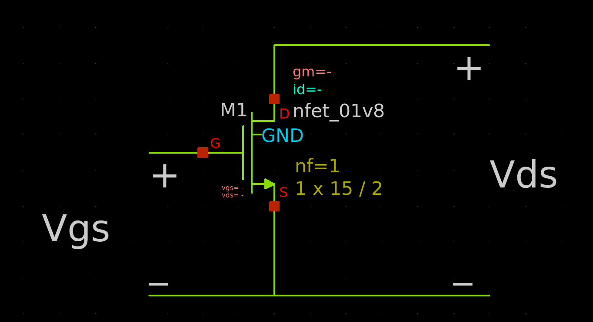

# Introduction 
- Mosfet (Metal Oxide Field Effect Transistor) is an electronic component that can act as a switch or an amplifier based on biasing and can control flow of current with change in input (gate) voltage  
- NMOS will be taken as reference : 

# Regions of Operation
- For switching operations we use cutoff (OFF switch) and triode region (ON switch) 
- For amplification we use saturation region 
## Cutoff 
There is no flow of current from drain to source in this region 

Condition: $V_{gs} < V_{th}$
## Triode 
In this region, mosfet acts as a voltage controlled resistor

## Saturation 
In this region, mosfet behaves like a voltage controlled current source as now drain current is not dependent on drain to source voltage it is now controlled by gate voltage

# DC Load Line 
Common source amplifier with drain resistance

# Quiscent point
- Intersection of Mosfet transfer characteritics and dc load line 
- Q point determines the proper region of operation and DC drain current, DC drain voltage
